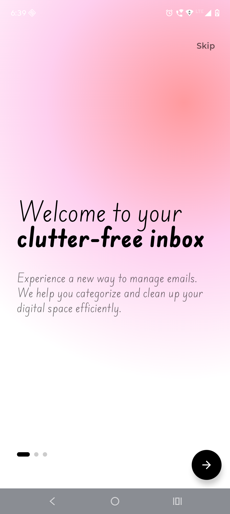
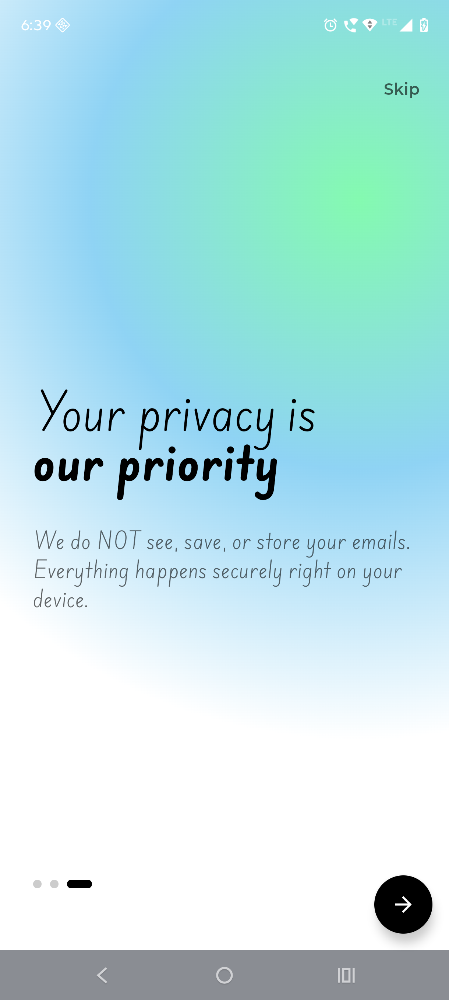
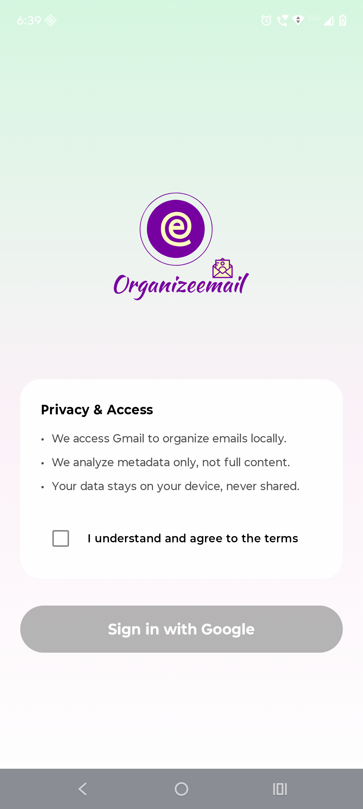
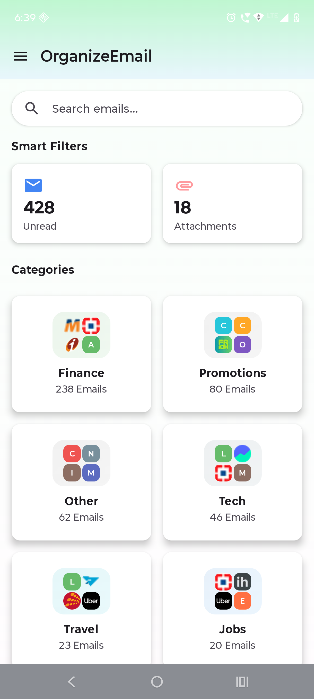
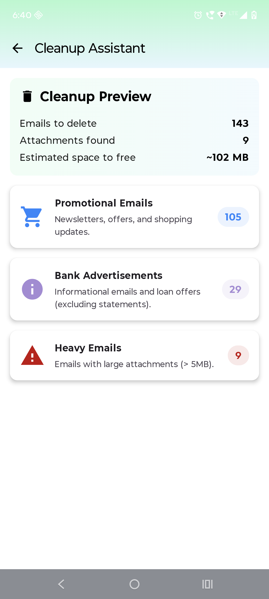
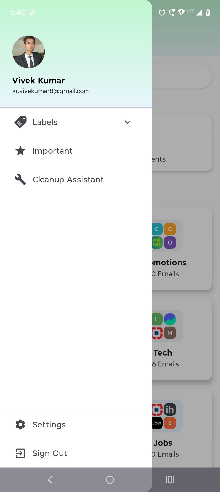
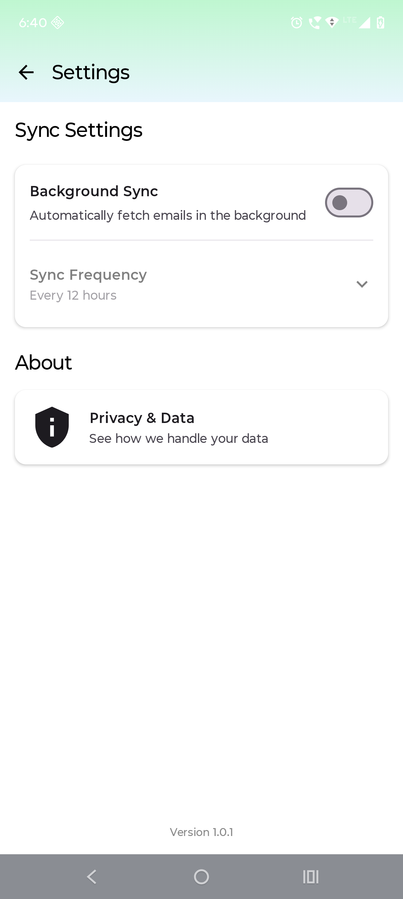

# 📧 Smart Gmail Organizer

A privacy-first Gmail organization and cleanup assistant that helps users take control of their inbox through intelligent categorization, smart filters, and secure cleanup — without ads or data sharing.

---

## Overview

Smart Gmail Organizer is an application built using the official Gmail API to help users organize, filter, and clean their inbox efficiently.  
The app is designed with a security-first approach, ensuring that user data remains private and fully under user control.

---

## Screenshots

### Onboarding & Authentication

  
  
  

  
    Fig 1: Onboarding introduction &nbsp;&nbsp;|&nbsp;&nbsp;
    Fig 2: Feature highlights &nbsp;&nbsp;|&nbsp;&nbsp;
    Fig 3: Secure Gmail authentication
  

---

### Core Features

  
  
  

  
    Fig 4: Smart email categorization &nbsp;&nbsp;|&nbsp;&nbsp;
    Fig 5: Cleanup assistant with storage insights &nbsp;&nbsp;|&nbsp;&nbsp;
    Fig 6: User profile
  

---

### Settings

  

  
    Fig 7: Application settings
  

---

## Features

### Intelligent Email Categorization
Automatically organizes emails into meaningful categories:
- Shopping
- Education
- Banking
- Finance
- Promotions
- Utilities
- Others

### Smart Filters
Quickly filter emails using:
- Unread emails
- Emails with attachments
- Promotional emails
- Large emails
- Old and inactive emails

### Smart Cleanup Assistant
- Review emails grouped by category
- Bulk delete emails safely
- View real-time storage freed during cleanup

### Offline Access & Performance
- Cached email metadata for offline access
- Background loading for smoother performance
- Optimized Gmail API usage

---

## Security & Privacy

User privacy is a core principle of this application.

- Uses official Gmail API with OAuth 2.0 authentication
- The developer cannot read, store, or extract email content
- No ads
- No data sharing with third parties
- No user tracking or profiling

All actions are performed only with explicit user authorization.

---

## Gmail API Permissions

The app requests only the minimum required Gmail API scopes:

| Permission | Usage |
|----------|------|
| Read metadata | Email categorization and filtering |
| Modify labels | Organizing emails |
| Delete emails | User-initiated cleanup |

No additional permissions are used.

---

## Architecture Overview

- Secure OAuth 2.0 authentication
- Gmail API integration
- Local caching layer
- Background synchronization
- Modular and scalable design
